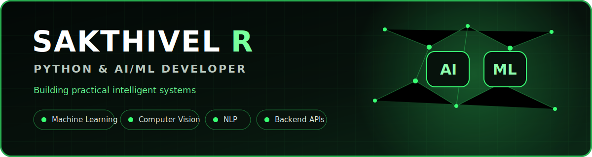

<div align="center">



Building practical intelligent systems with **Python, Machine Learning, Computer Vision and NLP**

[](https://portfolio-14b57.web.app)
[](https://www.linkedin.com/in/sakthivel-r72a15232)

</div>

## About Me

```python
sakthivel = {
    "role": "Python & AI/ML Developer",
    "education": "B.E. Computer Science & Engineering (2026)",
    "focus": ["Machine Learning", "Computer Vision", "NLP", "Backend APIs"],
    "location": "Tamil Nadu, India",
    "open_to": "Entry-level Python and AI/ML opportunities"
}
```

- Built and deployed NLP, CNN, recommendation, and full-stack applications
- National Finalist at **Odoo Hackathon 2025**
- Round 2 National Qualifier at **Cyber Guard AI Hackathon 2025**
- B.E. CSE graduate with **7.97/10 CGPA**

## Tech Stack

### AI, Machine Learning & Computer Vision


### Backend, Databases & Web


### Cloud & Development Tools


## Featured AI Projects

<table>
<tr>
<td width="50%" valign="top">

### Emotion-Based Movie Recommendation

CNN-powered system that detects facial emotion in real time and recommends movies.

**Stack:** Python, TensorFlow, Keras, OpenCV, FastAPI, MySQL, Docker

- Custom CNN trained with FER2013
- Real-time OpenCV inference
- 85%+ reported recognition accuracy

[View Repository](https://github.com/Sakthi-1679/Final-Complete)

</td>
<td width="50%" valign="top">

### Cyber Crime Report Classification

NLP pipeline that classifies cybercrime complaint text through a REST API.

**Stack:** Python, NLP, TF-IDF, scikit-learn, FastAPI, MySQL

- End-to-end text preprocessing
- 90%+ reported classification accuracy
- Presented at I4C/MHA, New Delhi

[View Repository](https://github.com/Sakthi-1679/IND_AI-Hackathon)

</td>
</tr>
</table>

## Professional Experience

### Freelance Web Developer - Instil Academy

- Delivered a full-stack e-learning platform for IIT-JEE/NEET students
- Built secure APIs using Node.js, Express, Prisma and MySQL
- Integrated Google OAuth, JWT authentication and Razorpay payments
- Deployed using Google Cloud Platform and Vercel

## GitHub Activity

<div align="center">


</div>

---

<div align="center">

### Learn. Build. Deploy. Improve.

</div>
